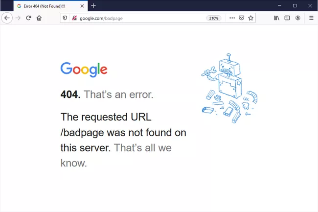

# Web Scraping Notes

## Plan for Today
> 1. [Install Python IDE, packages](Python_IDE_Setup.md)
> 2. Understanding HTTP
> 3. Parsing HTTP response with selectors (Xpath and CSS)
> 4. Live coding to scrape webpage
> 5. Write crawler for domain-wise crawling (time permitted)


## HTTP Protocol
> ### What is HTTP protocol?
>  Client Request - Server Response
> 
> 
>  ### How is HTTP related to Webscraping?
> Webscraping is following the HTTP protocol by sending automated requests to remote server, instead of parsing and displaying the response in a browser (e.g. Chrome, Safari), the script parse the response and extract the desired information.
> 
> ### Frequent HTTP Status Code:
> 
> 1. Successful responses: 200 (Successful)
> 2. Client-end error response: 401 (Unauthorized), 403 (Forbidden), 404 (Not Found)
     >     - Response Status Code starting with 4 means the client end has error(s).
     >     - Check the request detail
> 3. Server-end error response: 500 (Internal Server Error), 503 (Service Unavailable)
     >     - Response Status Code starting with 5 means the server end (Website Server) has error(s).
     >     - Nothing you can do about it, wait and retry

## Packages Installation and Import
> 1. [Scrapy](https://docs.scrapy.org/en/latest/): the core package for this workshop 
> 2. [Pandas](https://pandas.pydata.org/docs/getting_started/overview.html): the package for data parsing and processing
> 3. [BeautifulSoup](https://www.crummy.com/software/BeautifulSoup/): the package for response parsing

## Why Scrapy?
> 1. open source and collaborative framework
> 2. fast and powerful

## HTTP Response
> #### What is HTTP Response?
> 1. A HTTP response is made by a server to a client.
> 2. Contains three parts:
>    - Status Line
>    - HTTP Headers
>    - Body

## Webscraping Preparation

### Webscraping Steps
 1. 


> 1. Create Scrapy Project and Check the Project Directory
> ```azure
> scrapy startproject workshop 
> ```
> 2. Add directory *crawldata* under the upper workshop folder 
> 3. Open ```www.reuters.com/world/``` in your browser
> 4. Open terminal
> ```azure
> scrapy shell <url> 
> ```
> 5. Input:
> ```azure
> from scrapy.utils.response import open_in_browser
> open_in_browser(response)
> ```
> 6. Inspect HTML elements
> 7. Use XPath or CSS selector to locate the desired data and extract
> 
>   Tips:
>      1. Figure out the structure of the webpage, pay attention to the **nest** and **parallel** nodes
>      2. Choose the attribute for selector
>      3. Write [XPath/CSS](https://doc.scrapy.org/en/latest/topics/selectors.html#extensions-to-css-selectors) selector to locate and extract
> 
> 8. Test your XPath/CSS selector result 

## Write the First Spider
> 1. Create new python file *reuters.py* under folder **spiders**
> 2. Two-step
>    1. write *start_requests*
>    2. write *parse*
> 3. Export data  
 
## One Step Further: Write a Webcrawler
> 1. Difference between web scrape and crawl 
>   1. Crawler extract links within each page and follow through
>   2. Crawler sends concurrent HTTP requests and process multiple response simultaneously
>   3. Crawler processes extracted data from different pages and export to database
>   4. Crawler needs to be configured to not overload server
> 2. Introduce **Rule**: extract links to follow through, or to parse
> 3. Introduce **Item** and **ItemPipeline**: processing extracted data and export
> 4. Create Items and ItemPipeline in the *items.py* and *pipeline.py*
> 5. Register pipeline in the *settings.py*
> 6. Configure the crawler in the *settings.py*


> * [Full Query Parameters]()


### End

####  [Submit questions and issues here](https://github.com/Lucy-Family-Institute/CSSR-Workshop-Scrapy/issues) ####
